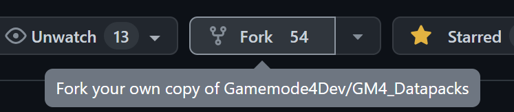
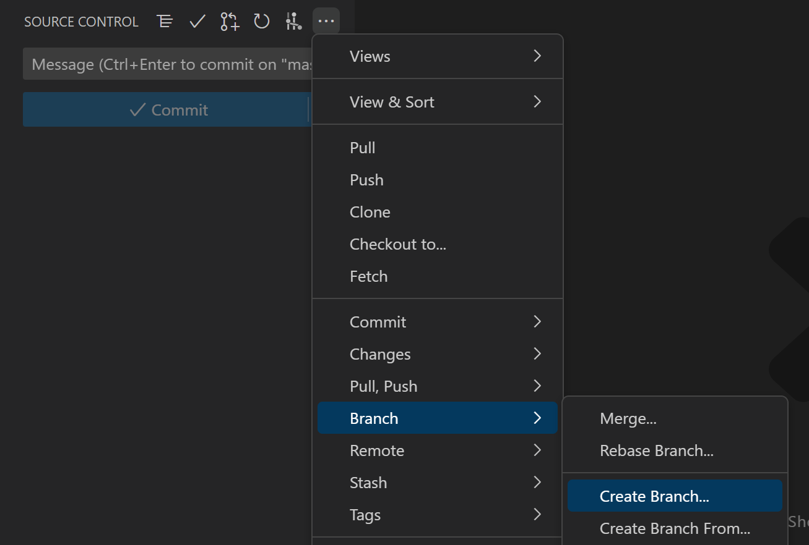
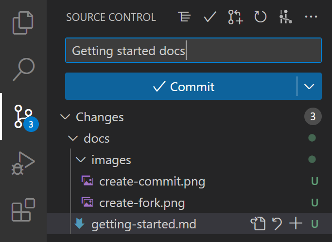
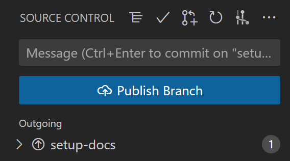
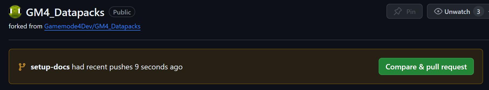
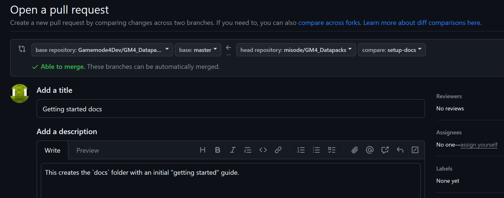

# Getting Started
This guide will show how to setup a local development environment to build, test, and contribute to our modules.

## Table of contents
* [Installation](#installation)
* [Building modules](#building-modules)
* [Common issues](#common-issues)
* [Submitting changes](#submitting-changes)

## Installation
To contribute to our project you need to install [Git](https://git-scm.com/downloads) and a text editor. We recommend [VSCode](https://code.visualstudio.com/).

Our modules are built using [beet](https://github.com/mcbeet/beet), which is a Python framework that allows us to automatically validate and generate part of our data packs and resource packs.

You will need to install [uv](https://docs.astral.sh/uv/) as project manager. If you don't already have Python installed, uv will do that automatically. We currently use Python 3.10.
```sh
# MacOS, Linux, or Git Bash (recommended)
curl -LsSf https://astral.sh/uv/install.sh | sh

# Powershell on Windows
powershell -ExecutionPolicy ByPass -c "irm https://astral.sh/uv/install.ps1 | iex"
```

Create your own fork of this repository.


Clone your fork locally:
```
git clone https://github.com/<username>/GM4_Datapacks.git
```

Open the `GM4_Datapacks` folder in VScode. Then run `uv sync`. This will install beet and all our other dependencies.

You are now ready to build our modules and make changes!

## Building modules
The source of each module is stored in each `gm4_*` folder. To convert them to a valid data pack, you need to use Beet:

```
uv run beet dev --link <world_name> --watch metallurgy *_shamir
```
* `uv run` makes sure that the command uses the correct Python dependencies
* `beet dev` builds the data packs to the `out` folder
* `--link <world_name>` copies the packs to a local world (filepath to the world's directory)
* `--watch` watches for file changes and then rebuilds
* `metallurgy *_shamir` specifies the list of module IDs to build

Building the release version of all modules is also possible. It will output the zipped data packs in the `release/<version>` folder. Running this could take a few minutes!
```
uv run beet -p beet-release.yaml build
```

## Common issues
When building the modules, sometimes you will encounter odd errors.

If you get an error about a beet plugin exception, many times it can be resolved simply by refreshing the beet cache.
```
uv run beet cache --clear
```

## Submitting changes
To submit changes to our modules, start by creating a branch. This allows us to review every change separately and allows you to make other changes in the future. Make sure you are on the `master` branch when you do this.



Alternatively, to create a branch, you can run:
```
git checkout -b <branch_name>
```

While making changes, test the data packs in a local world:

```
uv run beet dev --link <world_name> --watch <module_id>
```

When you are happy with the changes, create a commit on the branch.


Alternatively, to create a commit, you can run:
```
git add .
git commit -m "<commit_message>"
```

After committing the changes locally, push them to your fork. Click on "Publish Branch".


Alternatively, to push to the fork, you can run:
```
git push -u origin <branch_name>
```

On GitHub, create a pull request for this new branch. Click on "Compare & pull request".


Then, write a short description of the changes you made, whether it fixes a bug or changes behavior of a module. Click on "Create pull request" when you're done.


Your changes are now ready to be reviewed by our contributors. Thank you!
