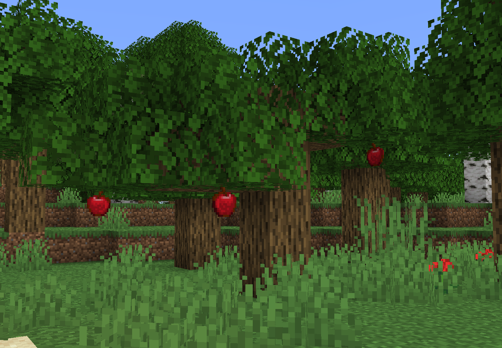

# Apple Trees <!--$headerTitle--><!--$pmc:delete-->

Apples don't grow on oak trees, silly Mojang! This datapack adds actual apple trees. Find them in forests or buy a sapling from a Wandering Trader.

<!--$localAssetToURL--> <!--$modrinth:replaceWithVideo--> <!--$pmc:delete-->

### Features:
- Apple trees naturally generate in Forests
    - Pick fully grown apples, or wait for them to fall on their own
    - Apples regrow every three 3 days
- Apple Saplings drop from chopped down trees, or can be bought from Wandering Traders
- If you're lucky, you might even find an ultra-rare golden apple tree in the wild
