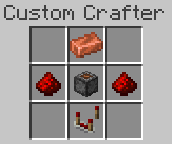
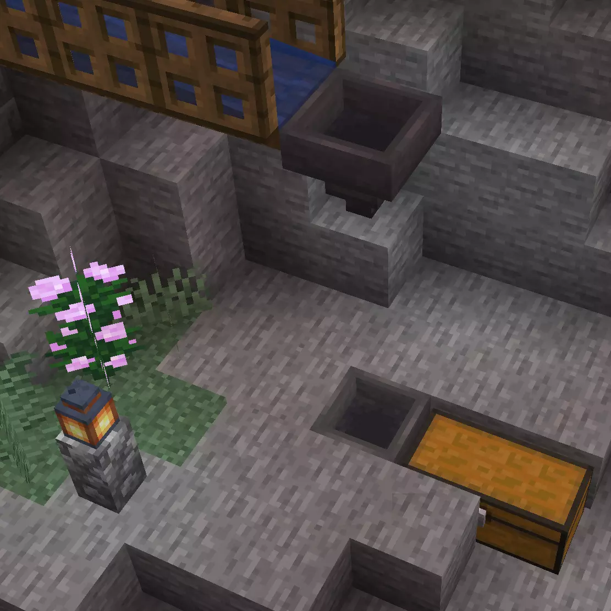

# Auto Crafting <!--$headerTitle--> <!--$pmc:delete-->

Excited for the new 1.21 crafter block? Want to start making the cake factory of your dreams right now? Try out Gamemode 4's take on auto-crafting, available right now for 1.19 and 1.20!<!--$pmc:headerSize-->

 <!--$localAssetToURL--> <!--$modrinth:replaceWithVideo--> <!--$pmc:delete-->

### Features
- Crafts any vanilla item.
- Set the recipe shape, give it ingredients one at a time, and power the piston to craft the item
- Build a cool steampunk multiblock structure

### Creation
Craft the auto-crafter in a [Custom Crafter](https://wiki.gm4.co/wiki/Custom_Crafters)

 <!--$localAssetToUrl-->

Build the Multiblock Structure

 <!--$localAssetToUrl-->

### Usage
- Set the shape of your recipe inside the Auto Crafter, using any items
- Fill the top barrel with the ingredients of your recipe, in order
- Power the Piston to craft the item
- Retrieve the result from the bottom barrel
