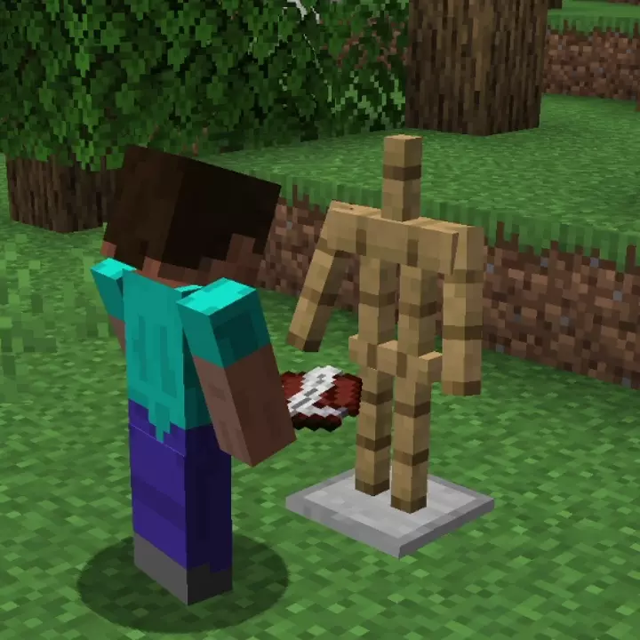

# Better Armour Stands <!--$headerTitle--> <!--$pmc:delete-->

Ever felt like Armour Stands looked a bit boring? Better Armour Stands lets your Armour Stands strike all the poses you want! Simply use a Book and Quill to edit Armour Stands. <!--$pmc:headerSize-->

 <!--$localAssetToURL--> <!--$modrinth:replaceWithVideo--> <!--$pmc:delete-->

### Features:
- All armor stands have arms by default
- Write commands into a Book and Quill to control your armor stands
    - [Click Here](https://wiki.gm4.co/wiki/Better_Armour_Stands#Codes) to see a full list of codes
- Copy and Paste poses
- Make custom statues
- Survival Friendly!

### Posing Codes
<!--$pmc:startTable-->
|Code       |Description                                    |
| :---:     |-----------------------------------------------|
|`arms`     |toggle arm visibility                          |
|`base`     |toggle base-plate visibility                   |
|`size`     |toggle small/tall size                         |
|`gravity`  |toggle gravity                                 |
|`visible`  |toggle invisibility                            |
|`turn`     |slowly spin right or left                      |
|`lock`     |disable interactions                           |
|`unlock`   |enable interactions                            |
|`pose`     |select and move body parts                     |
|`default`  |restore the default pose                       |
|`copy`     |copies pose to armor stand in offhand          |
|`paste`    |pastes pose from armor stand in offhand        |
|`equip`    |transfer player offhand to selected body part  |
<!--$pmc:endTable-->

### Expansion Packs
Want some preset poses? Download the [Poses Pack Expansion]($dynamicLink:gm4_poses_pack)

Add particles to your builds with the [Particles Pack Expansion]($dynamicLink:gm4_particles_pack)
