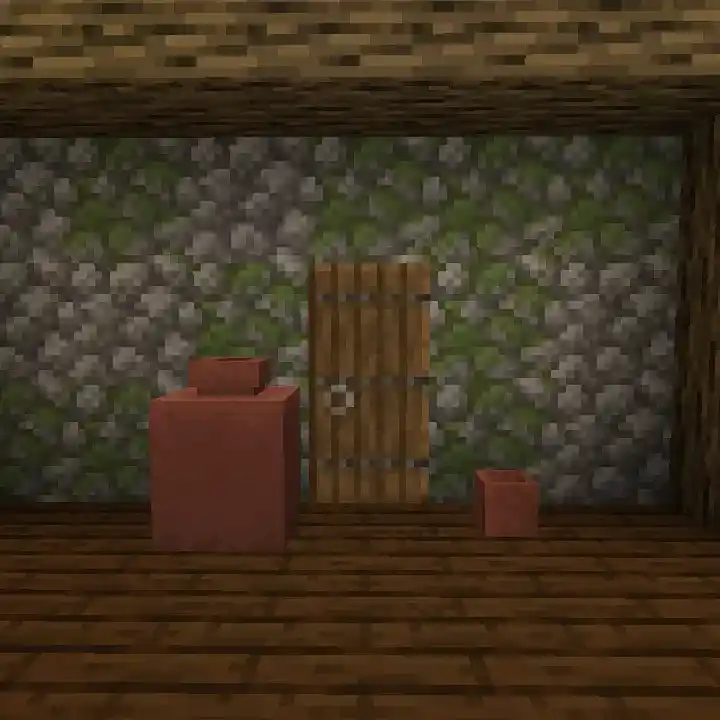

# Blossoming Pots<!--$headerTitle--><!--$pmc:delete-->

Greatly expands the selection of potable plants. Use Decorated Pots as abnormally large Flower Pots. Decorate in Style! <!--$pmc:headerSize-->

 <!--$localAssetToURL--> <!--$modrinth:replaceWithVideo--> <!--$pmc:delete-->

### Features
- To pot a plant, interact with a Decorated Pot or empty Flower Pot while holding a supported item.
- Flower Pots from this module can be emptied by interacting with an empty hand, just like vanilla Flower Pots. To empty a Decorated Pot of its plant, it must be broken.
- Decorated Pot plants often have multiple stages for a plant.

A full list of supported items can be found on the [Wiki](https://wiki.gm4.co/Blossoming_Pots#Supported_Items)
