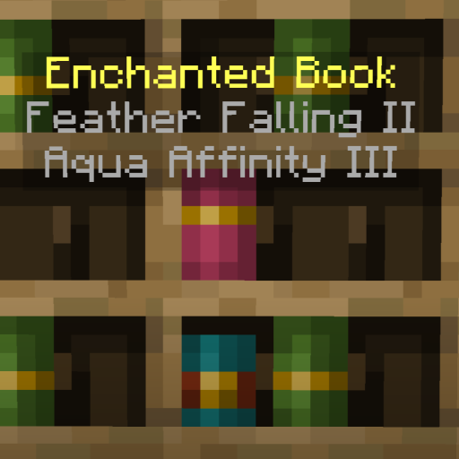

# Bookshelf Inspector<!--$headerTitle--><!--$pmc:delete-->

See what's in your Chiseled Bookshelves without having to take all the books out! <!--$pmc:headerSize-->

 <!--$localAssetToURL--> <!--$modrinth:replaceWithVideo--> <!--$pmc:delete-->

### Features
- Stand still and look at a book in a Chiseled Bookshelf to see its name.
- Shows the enchantments on Enchanted Books.
- Shows the author for Written Books.
- Works in any language and supports custom formatting for the name!
