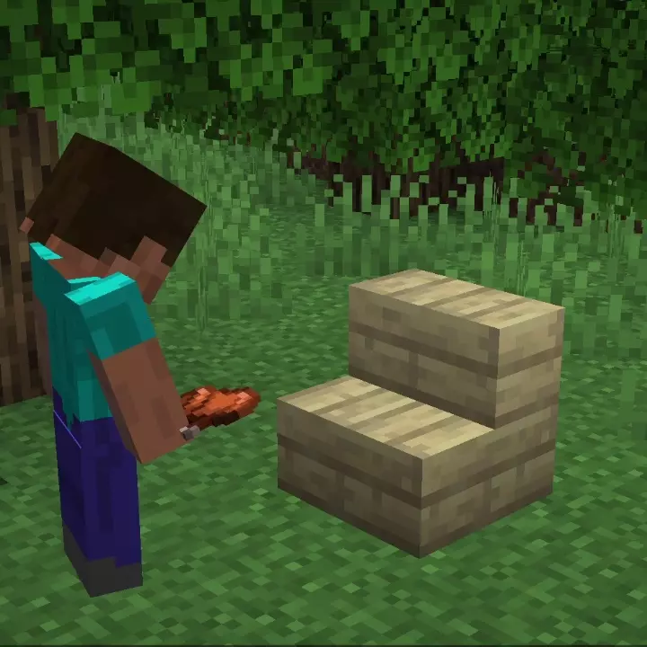
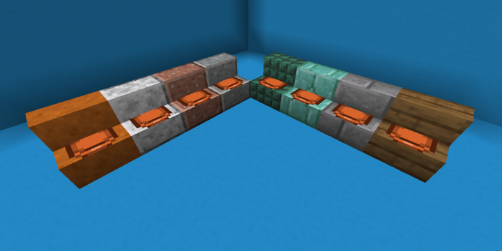

# Chairs <!--$headerTitle--> <!--$pmc:delete-->

Since the dawn of Minecraft, stairs have been used as chairs in every house you've ever built. With this simple datapack, players can actually sit on stairs by throwing a saddle on them. <!--$pmc:headerSize-->

 <!--$localAssetToURL--> <!--$modrinth:replaceWithVideo--> <!--$pmc:delete-->

### Features
- Throw a saddle on any stair block to turn it into a chair, which you can sit on
- Adds two chair-related advancements
- No texture pack required!

 <!--$localAssetToURL-->

### Expansion Packs
<!--- these will get links when those pages are made available-->
Want some preset poses? Download the [Poses Pack Expansion]($dynamicLink:gm4_poses_pack)

Add particles to your builds with the [Particles Pack Expansion]($dynamicLink:gm4_particles_pack)
