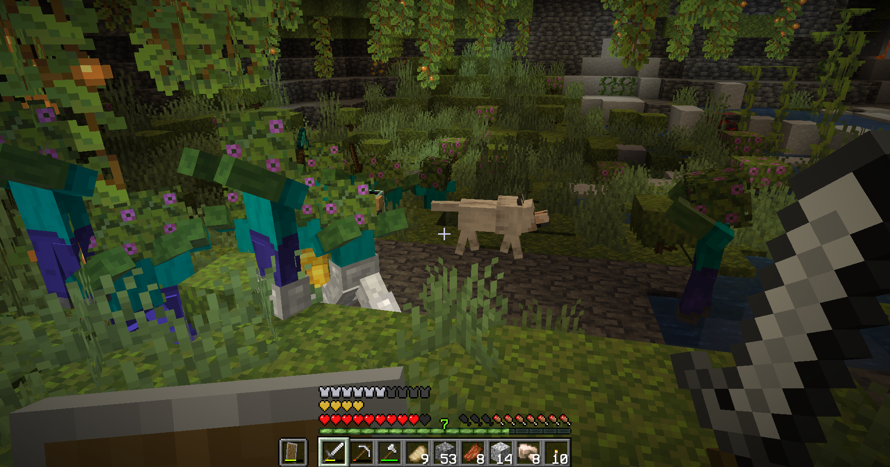

# Combat Expanded<!--$headerTitle--><!--$pmc:delete-->

Use special weapon and armor modifiers to defend against mobs that grow ever stronger!<!--$pmc:headerSize-->

 <!--$localAssetToURL--> <!--$modrinth:replaceWithVideo--> <!--$pmc:delete-->

### Features:
- The longer you stay alive the stronger mobs will become.
- Different biomes grant special buffs to mobs that spawn in them, creating bigger Slimes or Spore Zombies that keep regrowing!
- Weaker Phantoms that take damage if they try to fly into water, as they deserve.
- Mobs will drop new Unidentified armor and weapons. Using these will Identify them imbuing special modifiers that allow you to customize your gear!
- Modifiers range from a ramping speed boost to a loyal immortal dog to fight by your side. Or a weapon that applies random effects and enchants, if that's what you like.

A full list of all modifiers to mobs, weapons and armor can be found at the [Wiki](https://wiki.gm4.co/wiki/Combat_Expanded).
