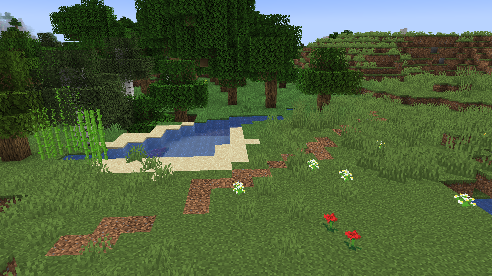

# Desire Lines<!--$headerTitle--><!--$pmc:delete-->

Ever felt like minecraft could do with a bit more immersion? This modular datapack adds a new cool interaction to your survival world in the form of self generating paths! When you walk between two places enough, a desire line will form transforming your grass into coarse dirt all on its own! <!--$pmc:headerSize-->

 <!--$localAssetToURL--> <!--$modrinth:replaceWithVideo--> <!--$pmc:delete-->

### Features
- When grass or dirt is stepped on it has a chance of turning into dirt or coarse dirt respectively.
- Flowers, grass and other plants will be trampled and break if walked on enough.
- Adds two new custom advancements to be obtained by trampling enough blocks.

### Compatability 
When playing with other Gamemode 4 datapacks, adds some bonus features:
- Adds the Celaro shamir when used with the [Metallurgy]($dynamicLink:gm4_metallurgy) datapack.
- Use the [Boots of Ostara]($dynamicLink:gm4_boots_of_ostara) module to spread nature instead of trampling it.
