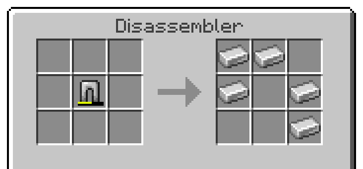

# Disassemblers<!--$headerTitle--><!--$pmc:delete-->

Break apart tools and armour for their materials.<!--$pmc:headerSize-->

 <!--$localAssetToURL--> <!--$pmc:delete-->

### Features
- Place items inside the disassembler block to get back their materials
- Works on leather, iron, gold tiers, shears and flint & steal.
- The more damaged an item, the less of the base material is returned
- Can be added to mob farms like Zombified Piglin farms to process their dropped tools

### Configuration
If you also want to allow diamond armour and tools to be disassembled, run the following command:
```
/scoreboard players set disassemble_diamonds gm4_disassembler 1
```
