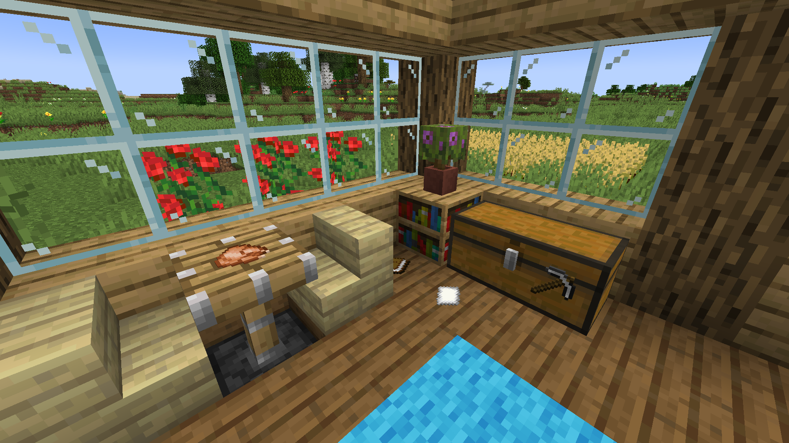

# Display Frames<!--$headerTitle--><!--$pmc:delete-->

Have you ever wanted to add invisible item frames to your survival world without feeling like you're cheating? This datapack will let you splash your item frames with invisibility potions to make them permanently invisible when displaying an item! <!--$pmc:headerSize-->

 <!--$localAssetToURL--> <!--$modrinth:replaceWithVideo--> <!--$pmc:delete-->

### Features
- When an invisibility potion is thrown in the vicinity of an item frame, it makes the item frame go invisible when displaying an item.
- When an invisible item frame is holding no item it will turn visible but show invisible potion effect particles to indicate that it is still able to turn invisible again.
- Adds a new custom advancement for turning an item frame invisible.
