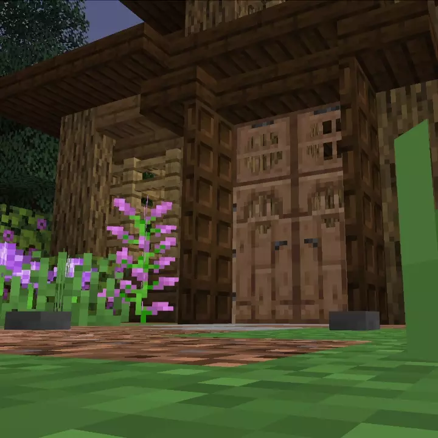

# Double Doors<!--$headerTitle--><!--$pmc:delete-->

Tired of clicking twice to open a double door?
Annoyed by the fact that doors are only two blacks tall?
Pressure Plates just don't cut it for closing doors behind you?
This data pack **automatically opens adjacent doors**, making double doors fully functional! Additionally, bottom **trapdoors** of matching wood type placed above a door **are opened alongside** the door when it is opened by a player. And maybe best of all, **doors close automatically** behind you! <!--$pmc:headerSize-->

 <!--$localAssetToURL--> <!--$modrinth:replaceWithVideo--> <!--$pmc:delete-->

### Features
- When a player interacts with a door that is part of a double door, both doors are opened/closed automatically!
- Open bottom-half trapdoors placed above a door will open/close alongside the door!
- Only doors and trapdoors which are of the same type and adjacent show this behavior.
- Doors are automatically closed behind the player!
- Hold shift or power a door with Redstone to enforce normal 'vanilla' door behavior!
