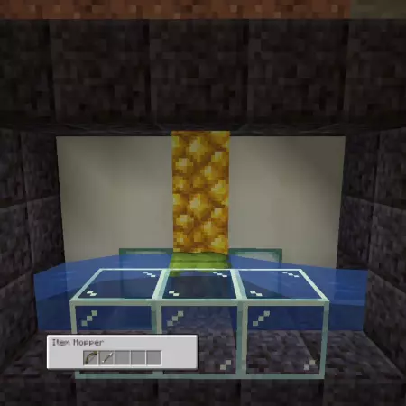

# Dripleaf Filters<!--$headerTitle--><!--$pmc:delete-->
Sort streams of items out with Big Dripleafs spitting items out that match the pattern.<!--$pmc:headerSize-->

 <!--$localAssetToURL--> <!--$modrinth:replaceWithVideo--> <!--$pmc:delete-->

### Features:
- Create a filter by placing a hopper in front of the dripleaf, with any matching items being moved into it
- Any other item will pass through the big dripleaf, so can be captured with a hopper underneath it
