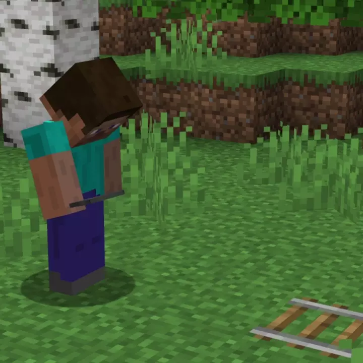

# Ender Hoppers <!--$headerTitle--><!--$pmc:delete-->

Hoppers now have a larger range and teleport items to them!<!--$pmc:headerSize-->

 <!--$localAssetToURL--> <!--$modrinth:replaceWithVideo--> <!--$pmc:delete-->

### Features:
- Creates a 9x9 range centered on the hopper where items can be teleported in
- Adds an Ender Hopper on rails, for mobile item collection device
- The hopper is disabled when a redstone signal is applied
