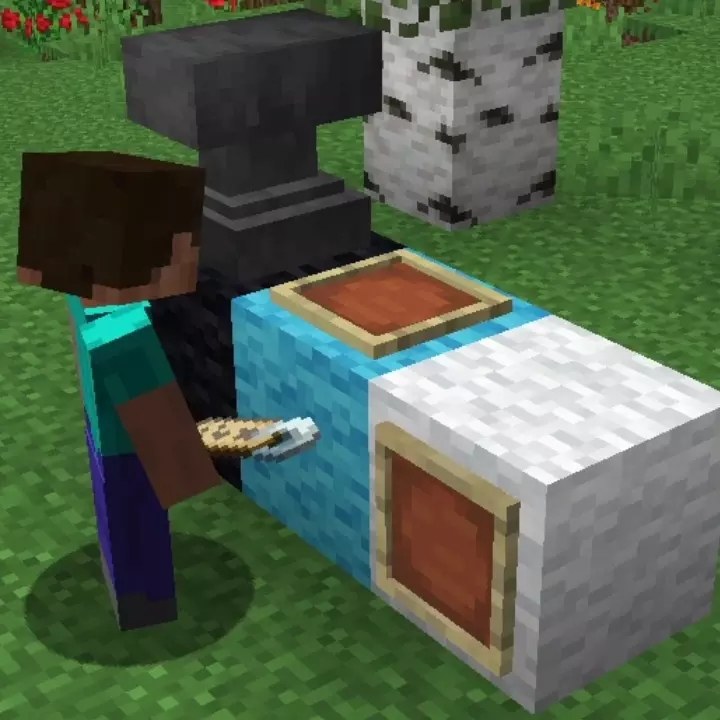
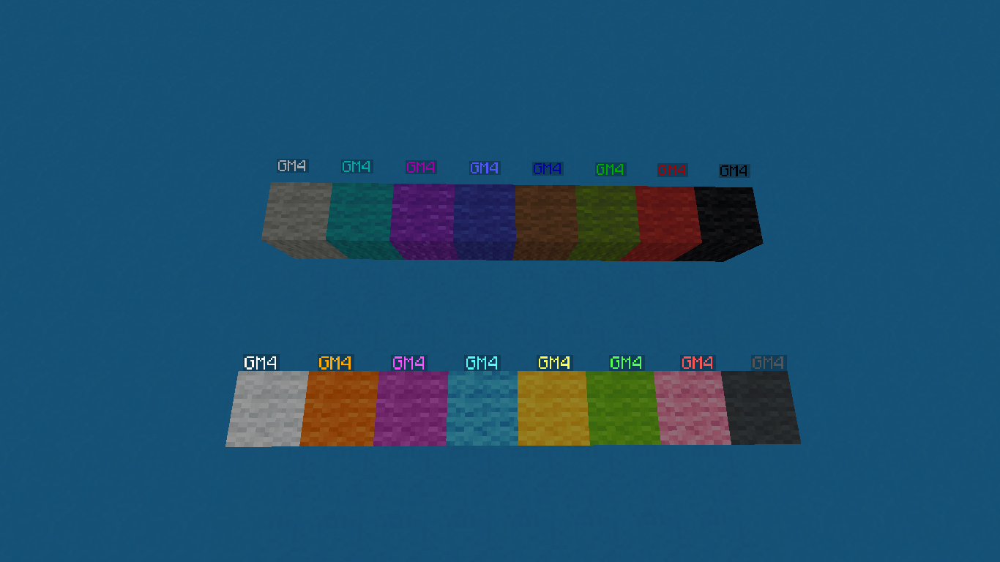

# Holographic Tags<!--$headerTitle--><!--$pmc:delete-->

Decorate your builds with floating text boxes, anywhere you want! This data pack is based on a concept by [SethBling](https://twitter.com/SethBling/status/1140675391012528128).<!--$pmc:headerSize-->

 <!--$localAssetToURL--> <!--$pmc:delete-->

### Features
- Place a named Name Tag in an Item Frame to create a floating text box
- Place an Item Frame in the same spot to remove it again
- Use a dyed Wool block to customize the color of the floating text

 <!--$localAssetToURL--> <!--$pmc:delete-->
