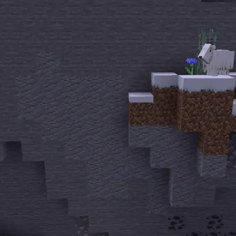

# Mountaineering<!--$headerTitle--><!--$pmc:delete-->

Scale mountains and cross fields of snow with ease! Climb steep slopes with crampons and descend into valleys on skis, perhaps with a jump on the way. <!--$pmc:headerSize-->

 <!--$localAssetToURL--> 

### Features:
- Crampons allow for vertical stone walls to be climbed
- Use skis to descend hills quickly and safely; your speed depends on the slope gradient
- Hold ski poles in each hand to gain jump boost effects; best paired with skis
- Adds two ski-related advancements
