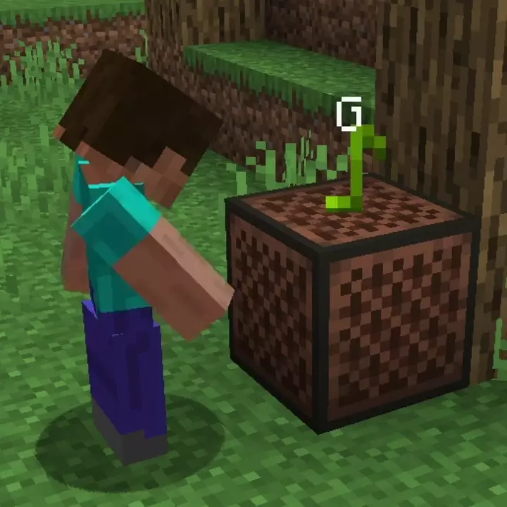

# Note Block Interface<!--$headerTitle--><!--$pmc:delete-->

Note Blocks have always been a bit... odd to use. Figuring out what note its set to involves a cryptic color scheme of the note particle, and if you miss the note you want, you have to go around the whole range again. This simple datapack displays the current note above a note block, and allows you to go backwards by sneaking. <!--$pmc:headerSize-->

<!--$localAssetToURL--><!--$modrinth:replaceWithVideo--><!--$pmc:delete-->

### Features:
- The current pitch of a note block is displayed above it when struck or tuned by the player.
- Enables tuning back down the scale by sneaking while tuning the note block
