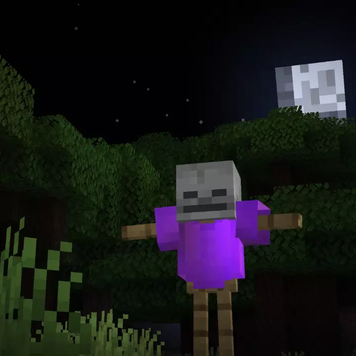

# Phantom Scarecrows<!--$headerTitle--><!--$pmc:delete-->

Do you regret that phantoms were added to the game but don't want to change any gamerules? This modular datapack lets you create phantom scarecrows that shoot homing fireqorkd projectiles at nearby phantoms to protect your base! <!--$pmc:headerSize-->

 <!--$localAssetToURL--> <!--$modrinth:replaceWithVideo--> <!--$pmc:delete-->

### Features
- Equipping a skull of an undead mob (Skeleton, Zombie or Wither Skeleton) to an armor stand along with a chestplate enchanted with a curse (Vanishing or Binding) will transform the armor stand into a Phantom Scarecrow.
- When a phantom flies within 25 blocks of the scarecrow, a homing firework will be fired towards the targeted phantom that will kill it in one shot.
- Adds one new custom advancement for getting struck by a homing phantom missile.
