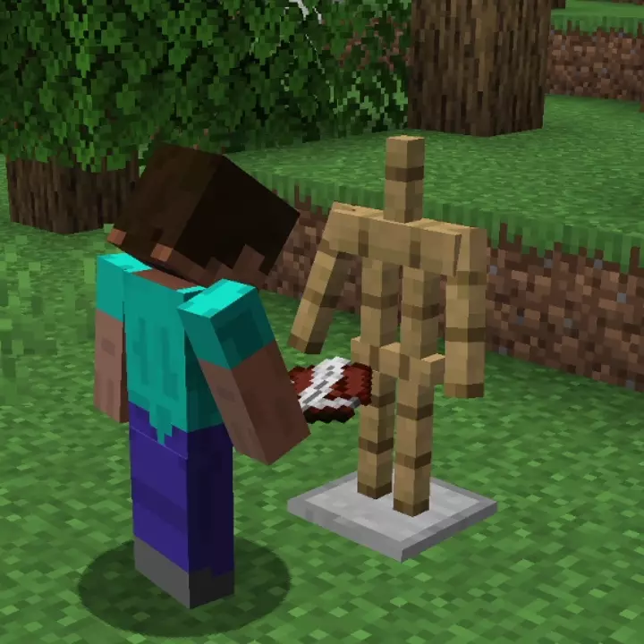

# Poses Pack<!--$headerTitle--><!--$pmc:delete-->

Customize your armour stands within an inch of their life. Make every part of them posed to your desire.<!--$pmc:headerSize-->

 <!--$localAssetToURL--> <!--$modrinth:replaceWithVideo--> <!--$pmc:delete-->

### Features
- Adds some default poses to armour stands to get your started
- Adds ability to pose arms, legs and head to some default positions

Read more options for poses on the [Wiki.](https://wiki.gm4.co/Better_Armour_Stands/Poses_Pack)
