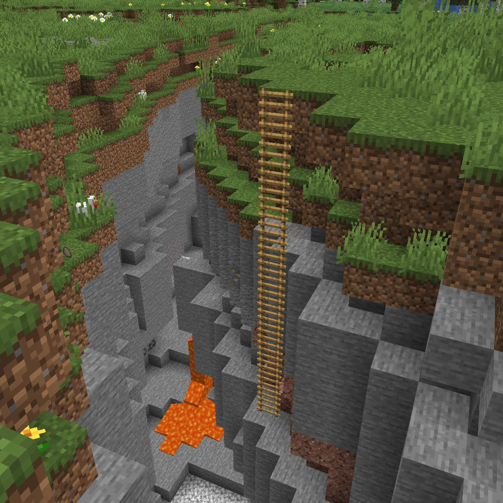

# Rope Ladders<!--$headerTitle--><!--$pmc:delete-->

Ever wanted to place unsupported ladders? This modular data pack allows you to extend the possibilities of your building by allowing ladders to be extended downward, even floating in the air. <!--$pmc:headerSize-->

 <!--$localAssetToURL--> <!--$modrinth:replaceWithVideo--> <!--$pmc:delete-->

### Features
- Players can extend ladders downward by using a ladder item on one end of a pillar of ladders.
- When the player breaks a hanging ladder it will break all the ladders below.
- If the top of a ladder is broken, then the entire stack will be "pulled up" for easy item collection.
