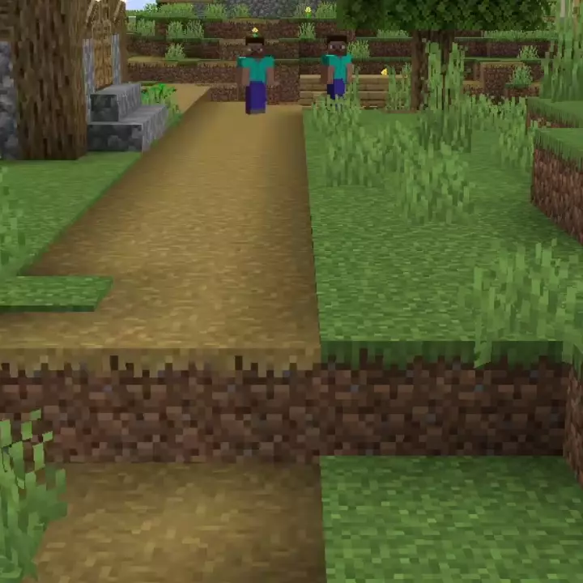

# Speed Paths<!--$headerTitle--><!--$pmc:delete-->

Connect your places with paths and get a speed buff for doing so!<!--$pmc:headerSize-->

 <!--$localAssetToURL--> <!--$modrinth:replaceWithVideo--> <!--$pmc:delete-->

### Features
- When walking on a path, the player is given a 20% speed boost.
- Speed from the path stacks with other sources
