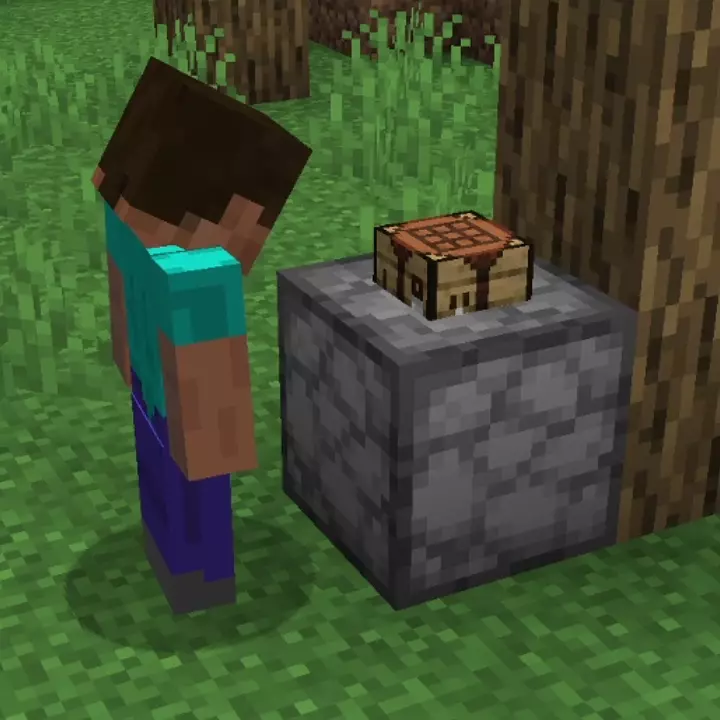

# Standard Crafting<!--$headerTitle--><!--$pmc:delete-->

A recipe pack that adds some handy additional recipes.<!--$pmc:headerSize-->

 <!--$localAssetToURL--> <!--$modrinth:replaceWithVideo--> <!--$pmc:delete-->

### Features:
- Adds a basic set of recipes to the Custom Crafter

A full list of recipes can be read on the [Wiki.](https://wiki.gm4.co/Standard_Crafting)
