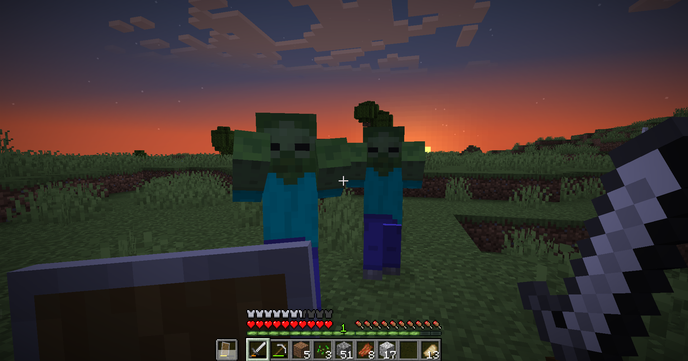

# Survival Refightalized<!--$headerTitle--><!--$pmc:delete-->

A reworked survival experience with more varied mobs and new armor and shield mechanics.<!--$pmc:headerSize-->

 <!--$localAssetToURL--> <!--$modrinth:replaceWithVideo--> <!--$pmc:delete-->

### Features:
- Armor acts like a second health bar instead of reducing incoming damage.
- Shields are disabled after being hit, adds the possibility to "parry" an attack.
- Mobs scale with spawn location, being stronger lower down in the world.
- Phantoms take damage if they try to fly into water, as they deserve.

A full detailed list of all mechanics can be found at the [Wiki](https://wiki.gm4.co/Survival_Refightalized).
