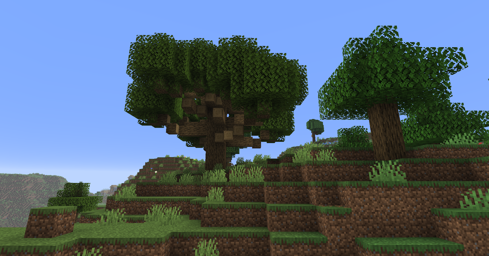

# Towering Trees<!--$headerTitle--><!--$pmc:delete-->

Adds mega and small tree variants to any sapling that is missing one! <!--$pmc:headerSize-->

<!--$localAssetToURL--><!--$modrinth:replaceWithVideo--><!--$pmc:delete-->

### Features
- Adds mega and small tree variants to any vanilla sapling that is missing one.
- Grow a mega mangrove tree and admire it! Or chop it down, your choice!
- Works with natural growth or bonemeal, no special interaction required, just plant a 2x2 of saplings!
