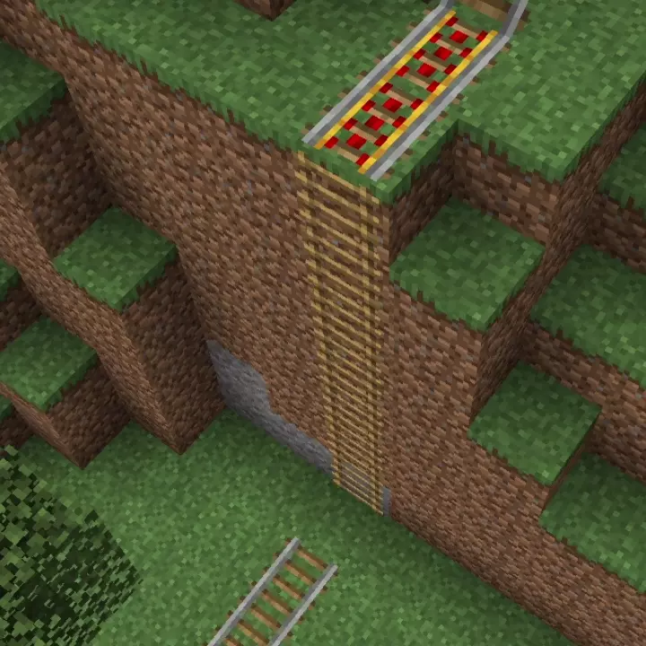

# Vertical Rails<!--$headerTitle--><!--$pmc:delete-->

Turn ladders into vertical railways for your minecarts! This simple datapack is great way to travel from the depths of a mineshaft to the top of a mountian, without the need for dizzying railway corkscrews<!--$pmc:headerSize-->

<!--$localAssetToURL--><!--$modrinth:replaceWithVideo--><!--$pmc:delete-->

### Features:
- Minecarts inside ladders automatically travel upwards until the reach the top, where they continue on regular rails.
- Adds a custom advancement for your first ride up a wall
