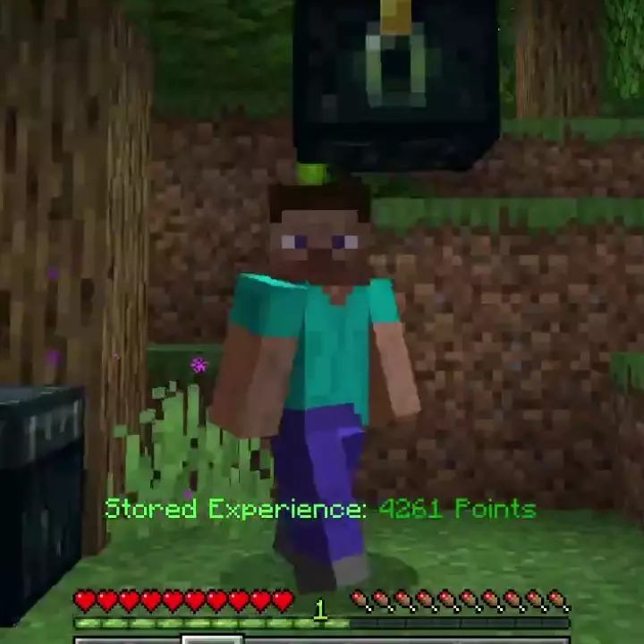

# XP Storage<!--$headerTitle--><!--$pmc:delete-->

Stand on top of an Ender Chest to store Experience, stand below to retrieve it!<!--$pmc:headerSize-->

 <!--$localAssetToURL--> <!--$modrinth:replaceWithVideo--> <!--$pmc:delete-->

### Features
- Turns any Ender Chest into an XP Bank
- Each players XP bank is separate, like a normal Ender Chest, and works across dimensions
- There is no practical limit to the max XP stored!
