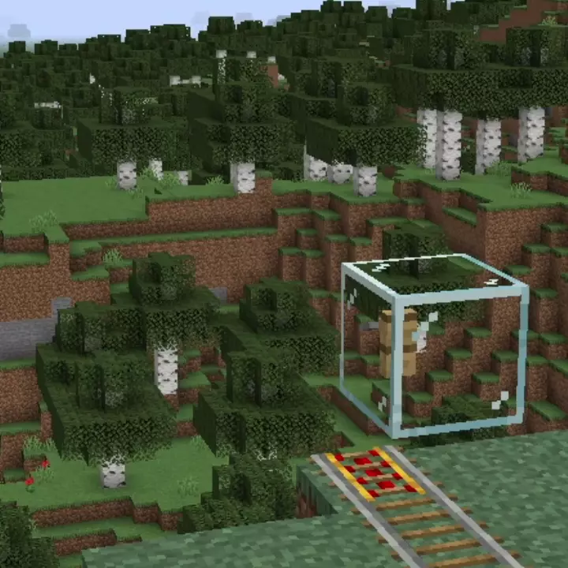

# Ziprails<!--$headerTitle--><!--$pmc:delete-->

Everyone loves building minecart rail systems, but giant mono-rails across your world can get to be an eyesore. With this simple datapack, enable your minecarts to hang from "ziprails" made of tripwire, much less intrusive 
than regular rail lines. <!--$pmc:headerSize-->

 <!--$localAssetToURL--> <!--$modrinth:replaceWithVideo--> <!--$pmc:delete-->

### Features:
- All minecart types can grab onto a "ziprail" by riding under the tripwire hook at one end.
- Minecarts will travel down a ziprail until it reaches the other end, much like a gondola or cable-car
- Adds a custom advancement for your first ride in the sky
